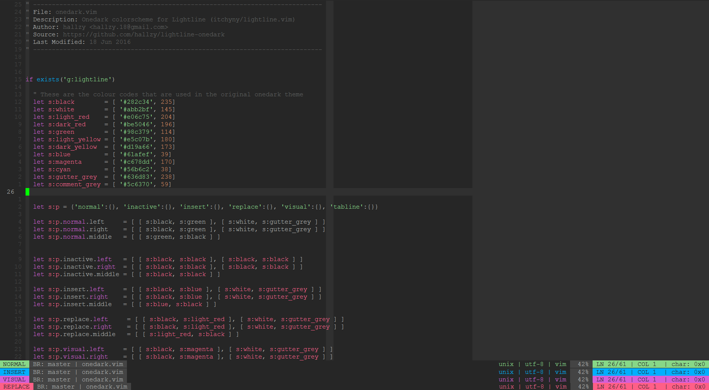

# lightline-onedark

Below is a picture of the onedark colorscheme in vim along with how lightline
looks with four different vim modes.

I am open to suggestions, and improvements, so if you like a different colour
combination then by all means, let me know, or create a pull request.

This is an [itchyny](https://github.com/itchyny) / [lightline.vim](https://github.com/itchyny/lightline.vim)
 theme for [joshdick](https://github.com/joshdick) / [onedark.vim](https://github.com/joshdick/onedark.vim).

I used the same colour codes used in the original onedark theme, so the colours
should match. I also tried to make the statusline look as similar to the
original airline theme as possible.
